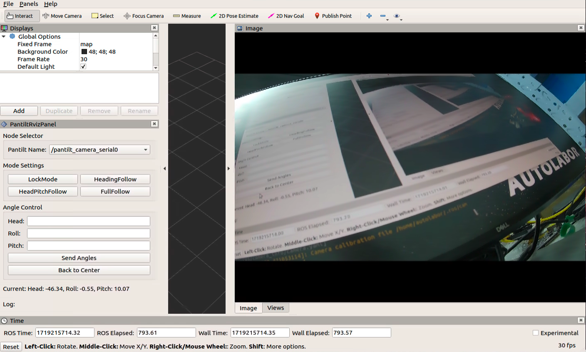

# 云台相机快速上手指南

## 1. 编译与安装

### 依赖项：

安装image_proc包，用于矫正图像。

```bash
    sudo apt-get install ros-noetic-image-proc
```

### 步骤：
1. 打开终端并导航到你的 ROS 工作空间目录：
   ```bash
   cd ~/catkin_ws
   ```
2. 下载以下三个包到 `src` 目录下：
    - `cv_camera`：用于图像获取和标定数据。
    - `pantilt_camera_serial`：用于云台串口驱动，控制云台转动。
    - `rviz_pantilt_plugin`：云台控制的 RViz 可视化插件。

3. 进入 `src` 目录后，使用以下命令编译工作空间：
   ```bash
   catkin_make
   ```
   如果你使用的是 `catkin_tools`，则可以使用：
   ```bash
   catkin build
   ```
   
4. Source 你的工作空间：
   ```bash
   source ~/catkin_ws/devel/setup.bash
   ```

## 2. 配置摄像头路径和串口路径

### 步骤：
1. 找到你的摄像头设备路径和云台串口路径：
   ```bash
   ls /dev/v4l/by-path
   ```
   ```bash
   ls /dev/ttyUSB*
   ```

2. 修改 `pantiltcamera.launch` 文件中的 `device_path` 和 `port_name` 参数：
    - `device_path`：摄像头设备路径，如 `/dev/video0`。
    - `port_name`：云台控制的串口路径，如 `/dev/ttyUSB0`。

3. 确保当前用户有设备操作权限，使用以下命令添加权限：
   ```bash
   sudo usermod -a -G dialout $USER
   sudo chmod a+rw /dev/ttyUSB0
   sudo chmod a+rw /dev/video0
   ```

## 3. 启动Launch文件



   ```bash
   roslaunch pantilt_camera_serial pantiltcamera.launch
   ```
这将启动云台控制节点，允许你通过话题或服务控制云台的转动。

在 RViz 中，你可以通过插件界面实时控制云台，并查看摄像头的图像变化。

## 4. ROS节点说明

### 节点功能：
- **cv_camera**：用于图像捕获和发布标定数据，提供矫正前后的图像。
- **pantilt_camera_serial**：通过串口控制云台的转动，发布当前的云台角度，并响应来自其他节点的控制命令。
- **rviz_pantilt_plugin**：提供 RViz 可视化控制界面，允许用户通过图形界面控制云台，并查看实时图像。

### 话题和服务：
- **cv_camera节点**：
    - 发布话题：
        - `/cv_camera/image_raw`：发布原始图像。
        - `/cv_camera/camera_info`：发布相机的标定信息。

- **pantilt_camera_serial节点**：
    - 发布话题：
        - `/pantilt_camera_serial/pantilt_angle_info`：发布当前的云台角度信息。
    - 订阅话题：
        - `/pantilt_camera_serial/pantilt_vel`：接收并执行云台速度控制指令。
    - 提供服务：
        - `/pantilt_camera_serial/send_command`：允许用户发送控制命令，如设置云台角度、速度等。

- **rviz_pantilt_plugin节点**：
    - 提供一个交互式界面，通过 RViz 可视化控制云台角度，并显示实时图像。

按照这些步骤操作，你可以快速上手并有效控制你的云台相机系统。