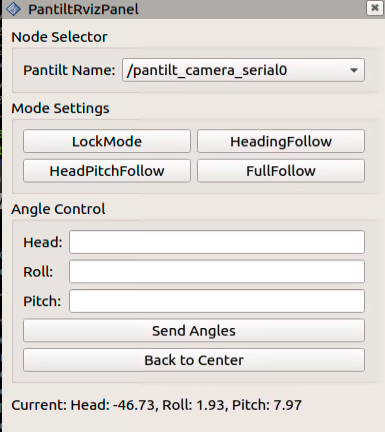
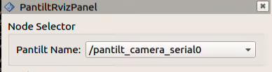
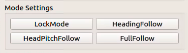
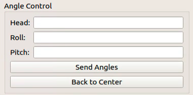
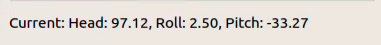

# Autolabor云台相机使用说明

## 简介
`PantiltRvizPanel` 是为 ROS rviz 环境开发的一个插件，旨在提供一个交互式的用户界面，用于控制和监视一个可调节的摄像头平台。此插件允许用户通过图形界面发送命令，控制摄像头的方向和行为，以及接收和显示摄像头的当前角度信息。

 

## 功能
- **节点选择**：用户可以从下拉列表中选择当前活动的摄像头节点。
- **模式设置**：用户可以设置摄像头的工作模式，包括锁定模式、跟随头部模式、跟随头部和俯仰模式及全跟随模式。
- **键盘控制**：用户可以使用键盘的 W、S、A、D 键来控制摄像头的上下左右移动。
- **角度设置**：用户可以输入具体的角度值，直接调整摄像头的方向。
- **角度反馈**：实时显示当前摄像头的角度信息。

## 使用方法
1. **选择摄像头节点**：
   在节点选择器下拉菜单中选择您希望控制的摄像头节点。

2. **设置工作模式**：
   提供四种工作模式的按钮：
    - **SetLockMode**：锁定当前方向。
    - **SetHeadingFollow**：摄像头跟随主体的头部方向。
    - **SetHeadingPitchFollow**：摄像头跟随主体的头部和俯仰方向。
    - **SetFullFollowMode**：摄像头全方位跟随主体。

3. **键盘控制**：
   
- 在使用键盘控制时，要将单击PantiltRvizPanel窗口，使其获得焦点，然后按下键盘上的相应按键。   

   - `W`或`Up`键：摄像头向上。
   - `S`或`Down`键：摄像头向下。
   - `A`或`Left`键：摄像头向左。
   - `D`或`Right`键：摄像头向右。

4. **角度设置**：
   
- 在界面提供的文本框中输入希望设置的角度值，单位是度，然后点击发送角度按钮。
- **Heading**方向的取值范围是：**[-160, 160]**
- **Roll**方向的取值范围是：**[-40, 40]**
- **Pitch**方向的取值范围是：**[-90, 90]**

> 注意：此处的角度都是相对于摄像头的初始位置而言的，初始位置是固定的。

5. **角度反馈**：
   界面将实时显示摄像头当前的角度信息。

> 注意：此处的角度都是相对于摄像头的初始位置而言的，初始位置是固定的。

## 安装
确保您的 ROS 环境已安装 rviz，并将此插件编译后加载到 rviz 中。

## 依赖
此插件依赖于 ROS 的通信机制和 rviz 的插件架构。确保您的系统中已正确安装 ROS 和 rviz。

